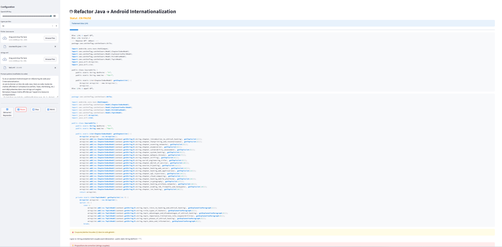

# I18nRefactorer

Automatically refactor your Java Android files by replacing all user-facing hardcoded strings with references to existing `strings.xml` resources!  
This tool uses OpenAI and provides a Streamlit interface for step-by-step processing, live feedback, correction suggestions, and perfectly formatted output code for seamless Android internationalization.



## Features

- ✨ **Automatic replacement** of all user-visible strings with `getString(R.string.key)` resource calls  
- ⚡ **Supports Activity, Adapter, Helper** (`getString` or `context.getString` as appropriate)  
- 🚦 **Interactive interface**: see progress, live logs, and full OpenAI API responses (debug mode)  
- 🔎 **Detects and warns** about cut or broken strings, unfinished `getString`, unclosed parentheses, etc.  
- 💡 **Correction suggestions** for incomplete code  
- 🧹 **Auto-reindents** `case`, `break`, and cleans duplicate `import`, `package`, `class` statements  
- 📤 **Download** the cleaned final Java code ready for use  
- 🪄 **Live-editable ChatGPT prompt** for advanced customization

## Requirements

- Python 3.8+
- An [OpenAI](https://platform.openai.com/) account and API key
- [Streamlit](https://docs.streamlit.io/):

```bash
pip install streamlit openai
```

## Usage

1. **Clone this repo**:

```bash
git clone https://github.com/raseur/I18nRefactorer.git
cd I18nRefactorer
```

2. **Launch the interface**:

```bash
streamlit run main.py
```

3. **Upload your Java file** and your (English) `strings.xml`
4. **Enter your OpenAI API key** (it stays hidden in the interface)
5. Click “Start/Resume” and follow the progress—warnings, suggestions, and logs are shown live  
6. **Download the final code** when everything is done!

## Customization

- Edit the system prompt in the sidebar to tune GPT’s code style or behavior
- Adjust block size for better splitting (longer or shorter methods/classes)
- Debug each OpenAI API call thanks to the detailed log & chat debug panel
